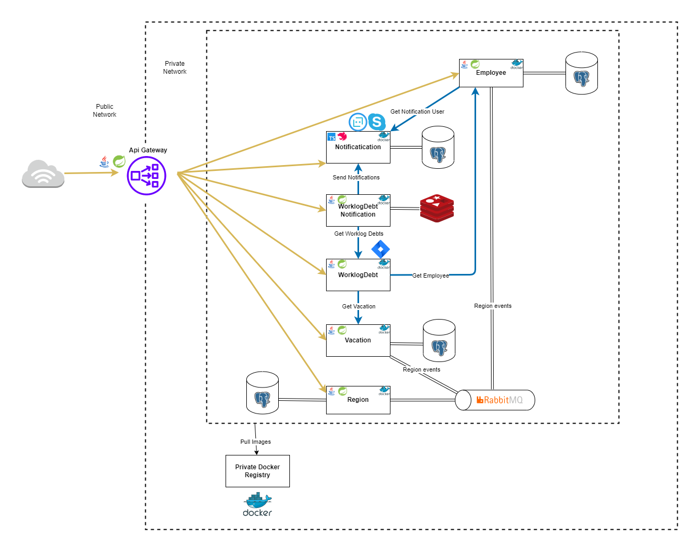

# Worklog Reminder

This is a microservice-based application that collects information about employees' JIRA worklog debts and sends
notifications
to employees to help them keep track of their work.

# Table of Contents

1. [Architecture](#architecture)
2. [Services](#services)
3. [Deploy](#deploy)
4. [Environment variables](#environment-variables)

## Architecture

This application is built using a microservice architecture,
which allows for scalability, modularity, and flexibility.
It consists of several independent microservices, each with its own unique functionality and domain.
These microservices can be easily deployed, updated, and scaled independently of each other.



## Services

| Service                                                                                                                    | Language          | Description                                                                                       |
|----------------------------------------------------------------------------------------------------------------------------|-------------------|---------------------------------------------------------------------------------------------------|
| [employee](https://github.com/letimofeev/worklog-reminder/tree/master/services/employee)                                   | Java/Spring Boot  | Manages employees                                                                                 |
| [notification](https://github.com/letimofeev/worklog-reminder/tree/master/services/notification)                           | TypeScript/NestJS | Sends notifications to users via Skype                                                            |   
| [worklog-debt-notification](https://github.com/letimofeev/worklog-reminder/tree/master/services/worklog-debt-notification) | Java/Spring Boot  | Collects worklog debt data, generates notifications and delegates to Notification Service to send |
| [worklog-debt](https://github.com/letimofeev/worklog-reminder/tree/master/services/worklog-debt)                           | Java/Spring Boot  | Collects and manages employees' worklog debts                                                     |
| [frontend](https://github.com/letimofeev/worklog-reminder/tree/master/services/frontend)                                   | TypeScript/React  | Provides a user interface for interacting with the services                                       |

## Deploy

### Docker-compose

1. Clone the GitHub repository
    ```shell
    git clone https://github.com/letimofeev/worklog-reminder.git
    ```

2. Install Docker on your machine if you haven't already. You can follow the instructions for your operating system on
   the [official Docker website](https://www.docker.com/)
3. Open a terminal and navigate to the `deploy/docker-compose` directory of the cloned repository
4. Verify that the `docker-compose.yaml` file is present in the directory
5. [Add](https://docs.docker.com/compose/environment-variables/set-environment-variables/)
   required [environment variables](#environment-variables)
6. Run the following command to start the containers defined in the Docker Compose file:
   ```shell
   docker-compose up -d
   ```
7. Wait for the containers to start up. You can check the logs of each container to verify that everything is working as
   expected
8. Once the containers are up and running, you should be able to access the application through a web browser or API
   client
9. To stop the containers, run the following command:
   ```shell
   docker-compose down
   ```

## Environment Variables

### Jira

- JIRA_BASE_URL - Jira base url
- JIRA_FORM_USER - Jira account username
- JIRA_FORM_PASS - Jira account password
- JIRA_BASIC_USER - username for basic authentication
- JIRA_BASIC_PASS - password for basic authentication

### Notification DB

- NOTIFICATION_DB - database name
- NOTIFICATION_DB_USER - database username
- NOTIFICATION_DB_PASS - database user password

### Employee DB

- EMPLOYEE_DB - database name
- EMPLOYEE_DB_USER - database username
- EMPLOYEE_DB_PASS - database user password

### Bot Framework

- MICROSOFT_APP_ID - azure app id
- MICROSOFT_APP_PASSWORD - azure app password
- MICROSOFT_APP_TYPE - azure app type
