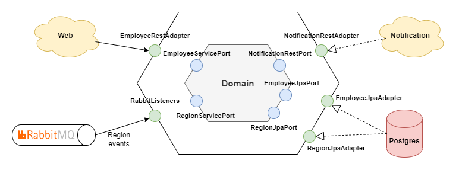

# Employee Service

This service is an API for managing employees. It provides endpoints for creating, retrieving, updating, and deleting
employee records. Users can add employees, view a single employee by ID or by Jira key, get a list of all employees,
update an existing employee, or delete an employee by ID.
The API returns data in JSON format and may return error responses for invalid requests or unexpected errors.

Implemented in Java 11 with Spring Boot.

[](https://spring.io/projects/spring-boot#overview)

## Architecture

This Employee service is implemented using hexagonal architecture, with a clear separation between the business logic in
the inner hexagon and the adapters that handle interactions with external systems.
The API controllers, persistence layer, and other external interfaces are implemented as adapters, providing input and
output ports that are decoupled from the core business logic.
This architecture allows for flexibility and scalability in the system, making it easier to test, maintain, and evolve
over time. The use of hexagonal architecture also promotes the modularity and reusability of the code, making it easier
to integrate with other systems or reuse components in different contexts.



## Employee API Endpoints

This API provides endpoints for managing employees.

### Add Employee

`POST /api/employees`

Adds a new employee to the system with the provided employee data.

Request Body

| Request      | Type   | Required | Description                     |
|--------------|--------|----------|---------------------------------|
| `firstName`  | string | Yes      | The first name of the employee  |
| `lastName`   | string | Yes      | The last name of the employee   |
| `jiraKey`    | string | Yes      | The jira key of the employee    |
| `skypeLogin` | string | Yes      | The skype login of the employee |

Response Body

| Name                  | Type    | Description                                               |
|-----------------------|---------|-----------------------------------------------------------|
| `id`                  | number  | The unique identifier of the employee                     |
| `firstName`           | string  | The first name of the employee                            |
| `lastName`            | string  | The last name of the employee                             |
| `jiraKey`             | string  | The jira key of the employee                              |
| `skypeLogin`          | string  | The skype login of the employee                           |
| `notificationEnabled` | boolean | Whether notifications are enabled for the employee        |
| `botConnected`        | boolean | Whether employee is connected to the notification service |

### Get Employee By ID

`GET /api/employees/{id}`

Retrieves the employee with the specified ID.

Parameters

| Name | Type   | Required | Description                           |
|------|--------|----------|---------------------------------------|
| `id` | number | Yes      | The unique identifier of the employee |

Response Body

| Name                  | Type    | Description                                               |
|-----------------------|---------|-----------------------------------------------------------|
| `id`                  | number  | The unique identifier of the employee                     |
| `firstName`           | string  | The first name of the employee                            |
| `lastName`            | string  | The last name of the employee                             |
| `jiraKey`             | string  | The jira key of the employee                              |
| `skypeLogin`          | string  | The skype login of the employee                           |
| `notificationEnabled` | boolean | Whether notifications are enabled for the employee        |
| `botConnected`        | boolean | Whether employee is connected to the notification service |

### Get Employee By JIRA Key

`GET /api/employees?jiraKey={jiraKey}`

Retrieves the employee with the specified JIRA key.

Parameters

| Name      | Type   | Required | Description                               |
|-----------|--------|----------|-------------------------------------------|
| `jiraKey` | string | Yes      | The JIRA key associated with the employee |

Response Body

| Name                  | Type    | Description                                               |
|-----------------------|---------|-----------------------------------------------------------|
| `id`                  | number  | The unique identifier of the employee                     |
| `firstName`           | string  | The first name of the employee                            |
| `lastName`            | string  | The last name of the employee                             |
| `jiraKey`             | string  | The jira key of the employee                              |
| `skypeLogin`          | string  | The skype login of the employee                           |
| `notificationEnabled` | boolean | Whether notifications are enabled for the employee        |
| `botConnected`        | boolean | Whether employee is connected to the notification service |

### Get All Employees

`GET /api/employees`

Retrieves a list of all employees in the system.

Response Body  
An array of employee objects, where each employee object contains the following fields:

| Name                  | Type    | Description                                               |
|-----------------------|---------|-----------------------------------------------------------|
| `id`                  | number  | The unique identifier of the employee                     |
| `firstName`           | string  | The first name of the employee                            |
| `lastName`            | string  | The last name of the employee                             |
| `jiraKey`             | string  | The jira key of the employee                              |
| `skypeLogin`          | string  | The skype login of the employee                           |
| `notificationEnabled` | boolean | Whether notifications are enabled for the employee        |
| `botConnected`        | boolean | Whether employee is connected to the notification service |

### Update Employee

`PUT /api/employees`

Updates an existing employee in the system with the provided employee data.

Request Body

| Request      | Type   | Required | Description                           |
|--------------|--------|----------|---------------------------------------|
| `id`         | number | Yes      | The unique identifier of the employee |
| `firstName`  | string | Yes      | The first name of the employee        |
| `lastName`   | string | Yes      | The last name of the employee         |
| `jiraKey`    | string | Yes      | The jira key of the employee          |
| `skypeLogin` | string | Yes      | The skype login of the employee       |

Response Body

| Name                  | Type    | Description                                               |
|-----------------------|---------|-----------------------------------------------------------|
| `id`                  | number  | The unique identifier of the employee                     |
| `firstName`           | string  | The first name of the employee                            |
| `lastName`            | string  | The last name of the employee                             |
| `jiraKey`             | string  | The jira key of the employee                              |
| `skypeLogin`          | string  | The skype login of the employee                           |
| `notificationEnabled` | boolean | Whether notifications are enabled for the employee        |
| `botConnected`        | boolean | Whether employee is connected to the notification service |

### Delete Employee By ID

`DELETE /api/employees/{id}`

Deletes the employee with the specified ID.

Parameters

| Name | Type   | Required | Description                           |
|------|--------|----------|---------------------------------------|
| `id` | number | Yes      | The unique identifier of the employee |

Response

This endpoint returns a `204 No Content` response on success, with no response body.

## Error Responses

### API Error

Response codes

| HTTP Status Code | HTTP Status           | Error Description                                     |
|------------------|:----------------------|-------------------------------------------------------|
| 400              | Bad Request           | One or more request parameters are missing or invalid |
| 404              | Not Found             | The requested resource was not found                  |
| 500              | Internal Server Error | An unexpected error occurred on the server            |

Response body

| Name      | Type   | Description                          |
|-----------|--------|--------------------------------------|
| `message` | string | Main error message                   |
| `status`  | number | Http status code                     |
| `errors`  | array  | Array of api sub-errors with details |

### Attribute API Sub-Error

Error related to employee attribute when adding/updating, for example attribute validation fail

| Name             | Type   | Description                            |
|------------------|--------|----------------------------------------|
| `message`        | string | Error message                          |
| `attributeName`  | string | The name of the conflicting attribute  |
| `attributeValue` | string | The value of the conflicting attribute |

Example

```json
{
  "message": "Validation failed",
  "status": 400,
  "errors": [
    {
      "message": "lastName must be specified",
      "attributeName": "lastName",
      "attributeValue": "null"
    }
  ]
}
```

## Integrations

### Integration with Notification Service

The service integrates with the `Notification Service` to retrieve employee notification status.
The integration is implemented using the `/api/users` endpoint provided by the Notification Service.  
Employee and notification user mapped by skype login: `skypeLogin` corresponds `login` field.

#### Get Users By Logins

`GET /api/users?logins={logins}`

Retrieves a list of notification users by list of skype logins.  
Method used to fill `botConnected` and `notificationEnabled` fields in the Employee model.

Parameters

| Name     | Type   | Required | Description                            |
|----------|--------|----------|----------------------------------------|
| `logins` | string | Yes      | Comma separated employees skype logins |

Response Body

An array of notification user objects, where each user object contains the following fields:

| Name          | Type    | Description                                    |
|---------------|---------|------------------------------------------------|
| `id`          | number  | The unique identifier of the notification user |
| `login`       | string  | The skype login of the notification user       |
| `displayName` | string  | The display name of notification user          |
| `enabled`     | boolean | Whether notifications are enabled for the user |

#### Update User

`PATCH /api/users`

Updates the notification user.  
Method used to update the notification enable flag when the employee is updated.

Request Body

| Request   | Type    | Required | Description                                    |
|-----------|---------|----------|------------------------------------------------|
| `id`      | number  | Yes      | The unique identifier of the notification user |
| `enabled` | boolean | Yes      | Whether notifications are enabled for the user |

Response

This endpoint returns an information about updated users count on success which is correctly not used.

#### Delete User By ID

`DELETE /api/users/{id}`

Deletes the notification user by id.  
Method used to delete the corresponding notification user when the employee is deleted.

Parameters

| Name | Type   | Required | Description                                    |
|------|--------|----------|------------------------------------------------|
| `id` | number | Yes      | The unique identifier of the notification user |

Response

This endpoint returns an information about deleted users count on success which is correctly not used.

## Frameworks

| Framework       | Description                                                                                                                                                                                           |
|-----------------|-------------------------------------------------------------------------------------------------------------------------------------------------------------------------------------------------------|
| Spring AOP      | Allows to add additional behavior, such as logging or security checks, to existing Java code by defining aspects that are applied to specific methods or classes at runtime                           |
| Spring MVC      | Provides support for building web applications, including RESTful web services and web applications with MVC architecture, using Java or Kotlin                                                       |
| Spring Data JPA | Provides a set of abstractions and helper classes to simplify the implementation of data access layers in Java applications using the Java Persistence API (JPA)                                      |
| Spring Boot     | Simplifies the development of stand-alone, production-grade Spring-based applications by providing a pre-configured and opinionated set of dependencies and conventions                               |
| Liquibase       | Database schema management tool that provides a consistent and repeatable way to track, version, and deploy database changes alongside application code                                               |
| Lombok          | Provides a set of annotations to automatically generate boilerplate code, such as getters, setters, and constructors, at compile time, reducing the amount of boilerplate code needed in Java classes |
| MapStruct       | code generation tool that simplifies the process of mapping between Java classes by generating mapping code based on annotations and interface definitions                                            |


## Environment Variables

- `POSTGRES_URL`
  - Url to connect to the employee database
- `POSTGRES_USER`
  - Username for the employee database
- `POSTGRES_PASSWORD`
  - Password for the employee database
- `NOTIFICATION_BASE_URL`
  - Notification service base url

