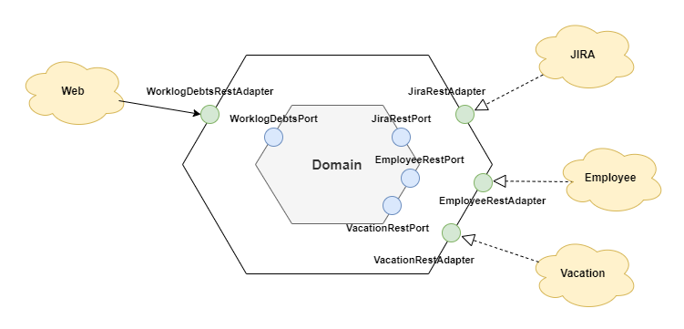

# Worklog Debt Service

WorklogDebt service is a microservice that retrieves worklogs from Jira and calculates worklog debts for employees. 
It uses information from the Vacation service to identify non-working days such as vacations and weekends

Implemented in Java 11 with Spring Boot.

# Table of Contents

1. [Architecture](#architecture)
2. [WorklogDebt API Endpoints](#worklogdebt-api-endpoints)
3. [OpenAPI](#openapi)
4. [Integrations](#integrations)
5. [Frameworks](#frameworks)
6. [Environment variables](#environment-variables)

## Architecture

This WorklogDebt service is implemented using hexagonal architecture, with a clear separation between the business logic in
the inner hexagon and the adapters that handle interactions with external systems.
The API controllers, persistence layer, and other external interfaces are implemented as adapters, providing input and
output ports that are decoupled from the core business logic.
This architecture allows for flexibility and scalability in the system, making it easier to test, maintain, and evolve
over time. The use of hexagonal architecture also promotes the modularity and reusability of the code, making it easier
to integrate with other systems or reuse components in different contexts.

## WorklogDebt API Endpoints

| Endpoint                                                 | Type    | Description                                                                                 |
|----------------------------------------------------------|---------|---------------------------------------------------------------------------------------------|
| `/api/worklog-debts`                                     | **GET** | Retrieve a list of employees' worklog debts for the current work week                       |
| `/api/worklog-debts?dateFrom={dateFrom}`                 | **GET** | Retrieve a list of employees' worklog debts from `dateFrom` to the end of current work week |
| `/api/worklog-debts?dateFrom={dateFrom}&dateTo={dateTo}` | **GET** | Retrieve a list of employees' worklog debts for period                                      |

## OpenAPI

### OpenAPI Specification

`GET /api/docs/services/worklog-debt`

Retrieves OpenAPI v3 JSON specification

### Swagger UI

`GET /api/docs/services/worklog-debt/swagger-ui`

Opens Swagger OpenAPI v3 specification UI

## Integrations

### Jira

The service integrates with the `JIRA` to retrieve employees' worklogs for a given period.
The integration is implemented using api provided by the Jira (Tempo Timesheets plugin)

### Employee Service

The service integrates with the `Employee Service` to retrieve employees' data.
The integration is implemented using the `/api/employees` endpoint provided by the Employee Service.
Employee and data from Jira worklog mapped by `jiraKey` field

### Vacation

The service integrates with the `Vacation Service` to retrieve data about non-working days for employee.
For example, an employee could be on vacation or sick, respectively, the worklog debt should not be counted.
The integration is implemented using the `/api/non-working-days?employeeId={employeeId}` endpoint provided by the Vacation Service

## Frameworks

| Framework         | Description                                                                                                                                                                                           |
|-------------------|-------------------------------------------------------------------------------------------------------------------------------------------------------------------------------------------------------|
| Spring Web        | Provides support for building web applications, including RESTful web services and web applications with MVC architecture, using Java or Kotlin                                                       |
| Spring Boot       | Simplifies the development of stand-alone, production-grade Spring-based applications by providing a pre-configured and opinionated set of dependencies and conventions                               |
| Spring AOP        | Allows to add additional behavior, such as logging or security checks, to existing Java code by defining aspects that are applied to specific methods or classes at runtime                           |
| Spring Validation | Framework for validating objects in an application, helping to ensure that the data being passed into the application is accurate and meets the necessary criteria                                    |
| Lombok            | Provides a set of annotations to automatically generate boilerplate code, such as getters, setters, and constructors, at compile time, reducing the amount of boilerplate code needed in Java classes |
| MapStruct         | code generation tool that simplifies the process of mapping between Java classes by generating mapping code based on annotations and interface definitions                                            |

## Environment variables

- `JIRA_BASE_URL`
  - Jira base url
- `JIRA_FORM_USER` 
  - Jira account username
- `JIRA_FORM_PASS`
  - Jira account password
- `JIRA_BASIC_USER`
  - Username for basic authentication
- `JIRA_BASIC_PASS` 
  - Password for basic authentication
- `JIRA_DEBUG_PASSWORD_ENABLED`
    - Is password displaying enabled in logs
- `JIRA_BASE_URL`
    - Jira base url
- `EMPLOYEE_BASE_URL`
    - Employee service base url
